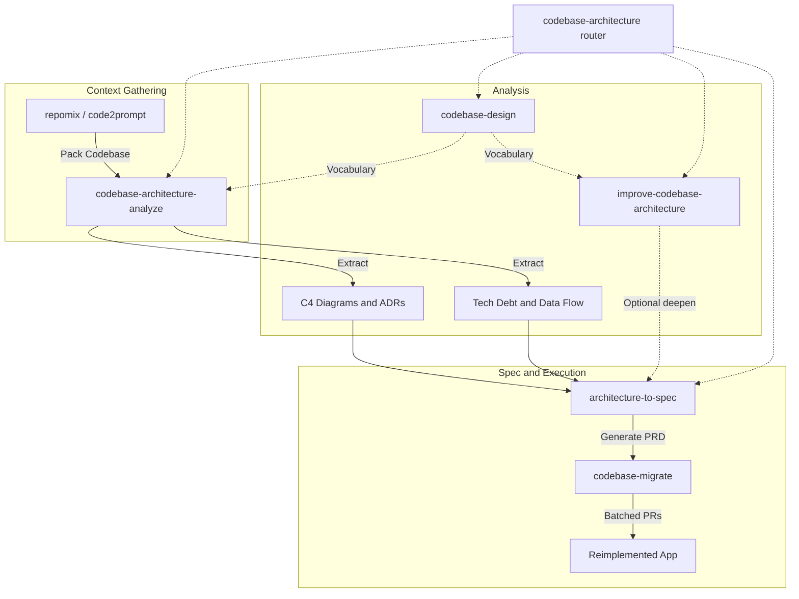

# Codebase Analysis & Reimplementation Playbook Chain

Canonical workflow from vault comparison
[[comparisons/codebase-analysis-reimplementation-skills]] (and mirrored below for offline use).

## TL;DR

Chain specialized skills — do **not** use one monolithic agent:

1. **Analyze / extract** with `codebase-architecture-analyze`.
2. **Name seams** with `codebase-design` vocabulary (deep modules) — also mandatory load for other skills.
3. **Optional deepen** with `improve-codebase-architecture` (HTML/Markdown candidates + grill).
4. **Spec** with `architecture-to-spec` (PRD from conversation + extracts).
5. **Execute** large transforms with external `codebase-migrate` (or repo-local migrate skill) in reviewable batches.

**Router:** skill `codebase-architecture` only chooses which specialized skill to run.

Complementary: repomix/code2prompt for context packing; deep-research / PavedPath for external GitHub evidence; official Archcore / feature-dev when installed.

## Workflow graph

## Skill roles in this plugin

| Skill | Role | Output default |
|-------|------|----------------|
| `codebase-architecture` | Router only — pick one specialized skill | None |
| `codebase-design` | Shared deep-module vocabulary; deepening + design-it-twice | In-session; no durable extract required |
| `codebase-architecture-analyze` | Full analyze + extract (C4, ADRs, debt, reimplementation specs) | Wiki `projects/{slug}/architecture/` else `{repo}/docs/architecture/` |
| `improve-codebase-architecture` | Scan for shallow modules → HTML (or offline MD) report → grill | Temp dir only |
| `architecture-to-spec` | Conversation → PRD/spec without interview | Wiki work item / optional tracker / `docs/architecture/spec-*.md` |

## External / optional skills (not bundled)

- **codebase-migrate** (Composio / awesome-codex-skills) — batched multi-file execution.
- **deep-research** — multi-source synthesis when external freshness matters.
- **PavedPath Code** — proven GitHub implementation paths.
- **grill-me / grilling** — attended design tree walk after improve picks a candidate.
- Official: Claude `feature-dev`, Codex `Archcore`, Brooks Lint, security boundary mappers.

## Source lineage

Distilled from:

- mattpocock/skills engineering design / improve / to-spec (MIT)
- FindSkill.ai codebase-architecture-explainer analysis pipeline
- lmammino/c4-codebase-architecture-skill evidence patterns (MIT)
- Vault comparison: `comparisons/codebase-analysis-reimplementation-skills.md`
- Local fleet delta: wiki-first `projects/{slug}/architecture/` routing
