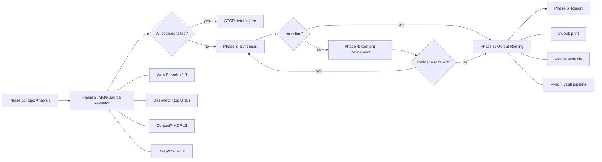

# Deep Research

## Overview

Multi-source research engine that queries web search, Context7, and DeepWiki in parallel, deep-fetches top sources for richer content, then synthesizes findings into a structured report with optional content refinement. Output is flexible: print to terminal, save as markdown file, or integrate with a skillwiki vault.



## When to Use

- User requests comprehensive research on a topic
- User wants deep investigation across multiple sources
- Topic involves libraries, frameworks, GitHub repos, or general concepts
- User mentions "research", "investigate", "compare", "analyze", or "deep dive"

Do NOT use for:
- Quick factual lookups (use direct web search or docs lookup)
- Single-source questions (use Context7 or web search directly)

## Output Modes

The skill supports three output modes, controlled by flags:

| Flag | Mode | Behavior |
|------|------|----------|
| *(default)* | **stdout** | Print structured report to terminal, no file writes |
| `--save <path>` | **file** | Write markdown report to specified path |
| `--vault` | **vault** | Integrate with skillwiki vault (requires configured vault) |

Vault mode is optional. The research engine works without any knowledge base.

## Workflow

### Phase 1: Topic Analysis

1. Parse topic string for keywords, libraries, frameworks
2. If `--vault` flag present: resolve vault via `skillwiki path`, run `skillwiki lang` for output language, search existing pages for cross-linking
3. If no `--vault`: proceed with research in user's language

### Phase 2: Multi-Source Research

Run these queries in parallel where possible.

**Web Search (2-3 queries)**
```
Query 1: <topic> (primary)
Query 2: <topic> best practices OR <topic> tutorial
Query 3: <topic> <current-year> (optional, for freshness)
```

**Deep-Fetch** (after search results arrive)
- Open the 2-3 most relevant source URLs from search results
- Extract specific passages needed for synthesis (not just snippet text)
- Prioritize official docs, changelogs, and primary sources over aggregator sites

**Context7 MCP** (max 3 calls)
```
1. resolve-library-id for library/framework mentioned
2. query-docs for usage patterns
3. query-docs for code examples if needed
```

**DeepWiki MCP**
```
ask_question on relevant repo about architecture, patterns, implementation
```

**Graceful degradation**: If any source fails, continue with remaining sources. Note failures in report.

### Phase 3: Synthesis

Compose research report with these sections:

1. **TL;DR** -- 3-5 bullets of key findings
2. **Overview** -- 1-2 paragraph synthesis
3. **Mermaid diagram** -- select type based on topic (see mapping table below). Skip for simple factual topics with no structural relationships

**Topic → Diagram Type Mapping**

| Research topic type | Diagram type | Example |
|---|---|---|
| System architecture / APIs | `sequenceDiagram` or component `flowchart` | How /goal's app-server handles thread/goal/set → emit event |
| Process / workflow | `flowchart LR` with decision nodes | Ralph Loop: plan→act→test→review→iterate |
| Comparison | Side-by-side `flowchart` | Codex /goal vs manual Ralph Loop |
| Concept relationships | `flowchart TD` with subgraphs | How /goal relates to config.toml, app-server, TUI |
| Data model / schema | `classDiagram` or `erDiagram` | Goal object: threadId, objective, status, tokenBudget |
| Timeline / changelog | `gantt` or timeline `flowchart` | v0.125 → v0.128 feature rollout |
| Simple factual | Skip diagram | "API accepts these 5 parameters" |
4. **Findings** -- organized by source type with collapsible callouts
   - `> [!abstract]- Web Search Findings`
   - `> [!info]- Documentation (Context7)`
   - `> [!tip]- Repository Insights (DeepWiki)`
5. **Analysis** -- merged patterns, recommendations, caveats
6. **Sources** -- numbered list with access dates

### Phase 4: Content Refinement (unless --no-refine)

Two-pass refinement to tighten the report before output:

**Pass A: Consolidation**
- Remove redundancy across callout sections
- Move repeated content into Analysis
- Merge similar examples or findings

**Pass B: Tightening**
- Reduce verbose prose
- Verify TL;DR accuracy against full findings
- Check Mermaid rendering (if diagram present)
- Trim sources to top 5-7 most authoritative

**Skip refinement** when:
- `--no-refine` flag is set
- All sources returned minimal content (nothing to consolidate)

### Phase 5: Output Routing

Route output based on active mode:

**stdout (default)**: Print the full structured report directly to terminal.

**`--save <path>`**: Write the report as a markdown file to the specified path. Create parent directories if needed. Save a checkpoint draft before refinement so the raw synthesis is recoverable if refinement introduces errors.

**`--vault`**: Delegate to skillwiki vault pipeline. See `references/vault-pipeline.md` for the full integration workflow (raw capture, schema validation, index/log updates). Also scan vault index for existing related pages and add wikilinks in the Related Notes section.

### Phase 6: Report

Print a summary block:

```
Deep Research Complete
----------------------
Topic: <topic>
Mode: stdout | file | vault

Sources Queried:
  - Web search: <count> queries
  - Deep-fetch: <count> pages opened
  - Context7: <library-id or "not used">
  - DeepWiki: <repo or "not used">

Refinement: <"applied" or "skipped (--no-refine)">
Output: <path or "terminal">
Warnings: <any>
```

## Flags

| Flag | Effect |
|------|--------|
| `--save <path>` | Write markdown report to file |
| `--vault` | Integrate with skillwiki vault (raw capture, typed pages, index/log) |
| `--type <concept\|comparison\|query\|entity>` | Force page type (vault mode only) |
| `--no-raw` | Skip raw source capture (vault mode: no provenance chain) |
| `--no-refine` | Skip content refinement phase |

## Stop Conditions

- All three source types fail (web, Context7, DeepWiki)
- `--vault` mode: `skillwiki path` returns NO_VAULT_CONFIGURED
- `--vault` mode: validation fails (do not write index/log)

## Failure Handling

| Failure | Action |
|---------|--------|
| Web search fails | Continue; omit web findings section |
| Deep-fetch fails | Continue with search snippets; note in report |
| Context7 fails | Continue; omit Context7 section |
| DeepWiki fails | Continue; omit DeepWiki section |
| All sources fail | STOP; report total failure |
| Refinement fails | Keep pre-refinement version; warn in report |
| Vault not configured (`--vault`) | Abort with advisory to run `skillwiki init` |
| Vault validate fails (`--vault`) | STOP; surface errors; do not write index/log |

## Tool Usage

- **Web search**: Current information
- **Web fetch**: Deep-fetch top sources for richer content extraction
- **Context7 MCP**: Library/framework documentation
- **DeepWiki MCP**: GitHub repository insights
- **skillwiki CLI** (vault mode only): `skillwiki path`, `skillwiki lang`, `skillwiki hash`, `skillwiki validate`

## Related Reference

- **references/vault-pipeline.md**: Vault-mode raw capture, validation, and index/log update workflow
