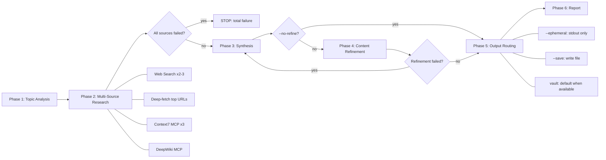

# Deep Research

## Overview

Multi-source research engine that queries web search, Context7, and DeepWiki in parallel, deep-fetches top sources for richer content, then synthesizes findings into a structured report with optional content refinement. Output is flexible: print to terminal, save as markdown file, or integrate with a skillwiki vault.



## Model Strategy

Deep research spawns parallel agents for source gathering and content refinement. To balance cost and quality, each phase pins to a model tier matched to its complexity:

| Phase | Model | Rationale |
|-------|-------|-----------|
| Phase 2: Research agents | `sonnet` (or `haiku` for simple fetches) | Parallel reading, fetching, summarizing — mechanical and independent work |
| Phase 3: Synthesis | *(inherit)* | Cross-source reasoning, pattern merging, diagram generation — benefits from parent model capability |
| Phase 4: Refinement | `sonnet` | Redundancy removal, prose tightening — editorial work, no architectural judgment |

All Phase 2 and Phase 4 agents are spawned via the Agent tool with `model: "sonnet"` (drop to `model: "haiku"` for simple single-page fetches). Phase 3 synthesis runs in the parent session context and inherits the parent model.

**Cost impact**: When the parent session runs Opus, research and refinement agents run on Sonnet (~5-10x cheaper per token), while only the cross-source synthesis phase uses the parent model.

**Agent model specification** (see `concepts/claude-code-agent-model-specification`): The Agent tool's `model` parameter overrides the agent definition's frontmatter `model:` field. Valid values: `"sonnet"`, `"opus"`, `"haiku"`, or a full model ID. Do NOT set model in skill files — only at Agent spawn time or in agent `.md` frontmatter.

## When to Use

- User requests comprehensive research on a topic
- User wants deep investigation across multiple sources
- Topic involves libraries, frameworks, GitHub repos, or general concepts
- User mentions "research", "investigate", "compare", "analyze", or "deep dive"

Do NOT use for:
- Quick factual lookups (use direct web search or docs lookup)
- Single-source questions (use Context7 or web search directly)

## Output Modes

The skill auto-detects the best output mode based on vault availability:

| Flag | Mode | Behavior |
|------|------|----------|
| *(auto, default)* | **vault** when `skillwiki path` succeeds, else **stdout** | Research persists as a query page when a vault exists |
| `--ephemeral` | **stdout** | Explicitly skip vault saving — print to terminal only |
| `--save <path>` | **file** | Write markdown report to specified path |
| `--vault` | **vault** | Force vault mode (error if no vault configured) |

**Why vault by default?** Deep research is expensive (multiple web searches, fetches, synthesis rounds). When a user has invested in a skillwiki vault, they've opted into knowledge persistence. Defaulting to vault ensures research survives context compression and becomes queryable by future sessions. The marginal cost of validate + index + log is trivial compared to the research itself.

## Workflow

### Phase 1: Topic Analysis

1. Parse topic string for keywords, libraries, frameworks
2. **Auto-detect output mode**: run `skillwiki path` — if it returns a valid vault, default to vault mode. If `NO_VAULT_CONFIGURED`, use stdout.
3. If vault mode active: run `skillwiki lang` for output language, search existing pages for cross-linking
4. If no vault: proceed with research in user's language

### Phase 2: Multi-Source Research

Spawn research agents in parallel. All agents use `model: "sonnet"` for cost efficiency — research tasks (search, fetch, read, summarize) are mechanical work that Sonnet handles well. For trivial single-page fetches, drop to `model: "haiku"`.

**Web Search Agents** (2-3 parallel)
```
Agent(description: "Web search 1", model: "sonnet", prompt: "Search for: <topic> (primary). Report key findings with source URLs.")
Agent(description: "Web search 2", model: "sonnet", prompt: "Search for: <topic> best practices OR <topic> tutorial. Report key findings with source URLs.")
Agent(description: "Web search 3", model: "sonnet", prompt: "Search for: <topic> current year. Report key findings with source URLs.")  // optional, for freshness
```

**Deep-Fetch Agents** (after search results arrive, 2-3 parallel)
```
Agent(description: "Deep-fetch N", model: "haiku", prompt: "Fetch and extract key passages from <URL>. Focus on specific facts, code examples, or claims relevant to <topic>. Skip navigation and boilerplate.")
```
- Prioritize official docs, changelogs, and primary sources over aggregator sites

**Context7 Agent** (parallel with web search)
```
Agent(description: "Context7 docs", model: "sonnet", prompt: "Using Context7 MCP: resolve-library-id for <library>, then query-docs for <topic> usage patterns and code examples. Max 3 total Context7 calls. Report findings.")
```

**DeepWiki Agent** (parallel with web search)
```
Agent(description: "DeepWiki repo", model: "sonnet", prompt: "Using DeepWiki MCP: ask_question on <repo> about architecture, patterns, and implementation relevant to <topic>. Report findings.")
```

**Graceful degradation**: If any agent fails, continue with remaining agents. Note failures in report.

### Phase 3: Synthesis

Compose research report with these sections:

1. **TL;DR** -- 3-5 bullets of key findings
2. **Overview** -- 1-2 paragraph synthesis
3. **Mermaid diagram** -- select type based on topic (see mapping table below). Skip for simple factual topics with no structural relationships

**Topic -> Diagram Type Mapping**

| Research topic type | Diagram type | Example |
|---|---|---|
| System architecture / APIs | `sequenceDiagram` or component `flowchart` | How /goal's app-server handles thread/goal/set -> emit event |
| Process / workflow | `flowchart LR` with decision nodes | Ralph Loop: plan->act->test->review->iterate |
| Comparison | Side-by-side `flowchart` | Codex /goal vs manual Ralph Loop |
| Concept relationships | `flowchart TD` with subgraphs | How /goal relates to config.toml, app-server, TUI |
| Data model / schema | `classDiagram` or `erDiagram` | Goal object: threadId, objective, status, tokenBudget |
| Timeline / changelog | `gantt` or timeline `flowchart` | v0.125 -> v0.128 feature rollout |
| Simple factual | Skip diagram | "API accepts these 5 parameters" |
4. **Findings** -- organized by source type with collapsible callouts
   - `> [!abstract]- Web Search Findings`
   - `> [!info]- Documentation (Context7)`
   - `> [!tip]- Repository Insights (DeepWiki)`
5. **Verification Methods** -- how to verify or reproduce the findings. This is critical: research that documents WHAT was found but not HOW to verify it creates fragile knowledge. Include:
   - The correct tools or commands to confirm the finding
   - Common wrong verification methods and why they fail (e.g., "checking `claude --help` for slash commands" vs "type `/` in session")
   - Links to canonical reference pages
6. **Analysis** -- merged patterns, recommendations, caveats
7. **Sources** -- numbered list with access dates

### Phase 4: Content Refinement (unless --no-refine)

Spawn a refinement agent with `model: "sonnet"` — tightening prose and removing redundancy is editorial work that doesn't require the parent model's capability.

```
Agent(description: "Refine report", model: "sonnet", prompt: "Refine this research report with two passes:

Pass A — Consolidation:
- Remove redundancy across callout sections
- Move repeated content into Analysis
- Merge similar examples or findings

Pass B — Tightening:
- Reduce verbose prose
- Verify TL;DR accuracy against full findings
- Check Mermaid rendering (if diagram present)
- Trim sources to top 5-7 most authoritative
- Verify Verification Methods section is actionable (not just 'check the docs')

Original report:
<insert synthesized report from Phase 3>")
```

**Skip refinement** when:
- `--no-refine` flag is set
- All sources returned minimal content (nothing to consolidate)

### Phase 5: Output Routing

Route output based on active mode:

**`--ephemeral` / stdout (when no vault)**: Print the full structured report directly to terminal.

**`--save <path>`**: Write the report as a markdown file to the specified path. Create parent directories if needed. Save a checkpoint draft before refinement so the raw synthesis is recoverable if refinement introduces errors.

**Vault (default when vault available)**: Delegate to skillwiki vault pipeline. See `references/vault-pipeline.md` for the full integration workflow (raw capture, schema validation, index/log updates). Also scan vault index for existing related pages and add wikilinks in the Related Notes section.

> **IMPORTANT — wiki-add-task routing guard**: Do NOT invoke `wiki-add-task` during Phase 5 for any reason. Any vault-capture intent (e.g., "save this to the vault", "capture this finding", "log this research") must route through `references/vault-pipeline.md` directly. If `wiki-add-task` activates, discard its output and resume with the vault-pipeline workflow.

**Vault page type**: Default to `queries/` (research results are filed queries). If the research reveals a generalized, reusable pattern (not specific to one investigation), also create a companion `concepts/` page capturing the transferable knowledge. The query captures the specific investigation; the concept captures the reusable insight.

### Phase 6: Report

Print a summary block:

```
Deep Research Complete
----------------------
Topic: <topic>
Mode: vault | stdout | file

Sources Queried:
  - Web search: <count> agents (model: sonnet)
  - Deep-fetch: <count> agents (model: haiku)
  - Context7: <library-id or "not used"> (model: sonnet)
  - DeepWiki: <repo or "not used"> (model: sonnet)

Synthesis: parent session (model: inherit)
Refinement: <"applied (model: sonnet)" or "skipped (--no-refine)">
Output: <vault page path, file path, or "terminal">
Pages created: <list of vault pages, if any>
Warnings: <any>
```

## Flags

| Flag | Effect |
|------|--------|
| `--ephemeral` | Skip vault saving — print to terminal only. Use when research is truly one-off. |
| `--save <path>` | Write markdown report to file |
| `--vault` | Force vault mode (error if no vault configured) |
| `--type <concept\|comparison\|query\|entity>` | Force page type (vault mode only, default: query) |
| `--no-raw` | Skip raw source capture (vault mode: no provenance chain) |
| `--no-refine` | Skip content refinement phase |

## Stop Conditions

- All three source types fail (web, Context7, DeepWiki)
- `--vault` flag explicitly set but `skillwiki path` returns NO_VAULT_CONFIGURED
- Vault mode: validation fails (do not write index/log)
- `wiki-add-task` skill activates during Phase 5 output routing (abort wiki-add-task, resume vault-pipeline.md directly)

## Failure Handling

| Failure | Action |
|---------|--------|
| Web search fails | Continue; omit web findings section |
| Deep-fetch fails | Continue with search snippets; note in report |
| Context7 fails | Continue; omit Context7 section |
| DeepWiki fails | Continue; omit DeepWiki section |
| All sources fail | STOP; report total failure |
| Refinement fails | Keep pre-refinement version; warn in report |
| Vault not configured (auto mode) | Fall back to stdout; note in report |
| Vault not configured (`--vault` flag) | Abort with advisory to run `skillwiki init` |
| Vault validate fails | STOP; surface errors; do not write index/log |

## Tool Usage

- **Agent tool** (`model: "sonnet"` or `"haiku"`): Spawn research and refinement agents. The `model` parameter is mandatory for Phase 2 and 4 agents — see Model Strategy section. See `concepts/claude-code-agent-model-specification` for the full model resolution rules.
- **Web search**: Current information (used inside web search agents)
- **Web fetch**: Deep-fetch top sources for richer content extraction (used inside deep-fetch agents)
- **Context7 MCP**: Library/framework documentation (used inside Context7 agent)
- **DeepWiki MCP**: GitHub repository insights (used inside DeepWiki agent)
- **skillwiki CLI**: `skillwiki path` (auto-detect vault), `skillwiki lang` (output language), `skillwiki hash`, `skillwiki validate`

## Related Reference

- **references/vault-pipeline.md**: Vault-mode raw capture, validation, and index/log update workflow
