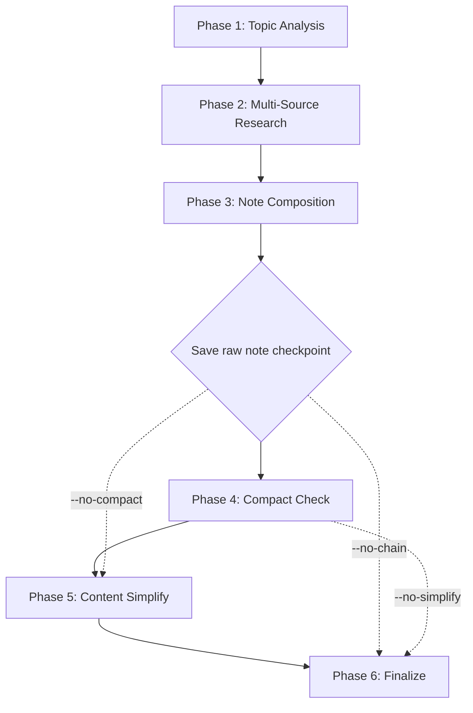

# Chain Orchestration

## TL;DR

- The deep-research skill runs a multi-phase pipeline: research, compose, compact, simplify.
- Raw note is saved before chain steps as a safety checkpoint.
- Chain failures preserve the raw note and warn the user.
- Flags `--no-compact`, `--no-simplify`, `--no-chain` control which phases run.

## Pipeline Overview

For detailed phase descriptions, see [SKILL.md](../SKILL.md#workflow).

## Flag Behavior

| Flag | Phase 4 | Phase 5 |
|------|---------|---------|
| (default) | Run | Run |
| `--no-compact` | Skip | Run |
| `--no-simplify` | Run | Skip |
| `--no-chain` | Skip | Skip |

## Checkpoint: Save Raw Note

**Critical**: Write the composed note to disk BEFORE any chain steps.

This ensures:
- User has the research even if chain fails
- Chain steps modify in place safely
- Recovery is possible from any failure

## Compact Check Early Exits

Before scoring neighbors, check for early exits:

1. If folder has 0 non-excluded `.md` files: Return immediately ("no neighbors to compare")
2. If folder has 1 neighbor: Single comparison only
3. If any comparison scores >= 80: Stop iterating (found merge candidate, no need to continue)

Score thresholds are defined in the compactor's [scoring.md](../../obsidian-dry-run-compactor/references/scoring.md).

## Content Simplify Rules

### Early Exit Conditions

Skip simplification if:
- Note has < 2 callout sections (nothing to consolidate)
- Note has < 500 words (already compact)
- Quick pattern scan finds no duplicates

### Pass A: Consolidation

- Scan callout sections for redundant information
- Move repeated content into Synthesis section
- Remove duplicate bullet points
- Merge similar code examples

### Pass B: Tightening

- Reduce verbose prose
- Verify TL;DR accurately reflects content
- Check Mermaid diagram renders (if present)
- Ensure all wikilinks are valid
- Trim excessive sources to top 5-7 most relevant

### What to Remove

- Redundant phrasing across callouts
- Filler words and hedging language
- Duplicate information stated in multiple sections
- Overly long code examples (truncate to key lines)
- Sources that don't add unique value

### What to Preserve

- All unique insights from each source
- Code examples that demonstrate distinct patterns
- Caveats and version-specific notes
- Original source attributions
- Mermaid diagrams that aid understanding

### TL;DR Verification

After simplification, verify TL;DR by checking:

1. Each bullet reflects actual content in the note
2. Most important insight is captured
3. Bullets are actionable where possible
4. No bullet is orphaned (content was removed but bullet remains)

## Failure Handling

| Phase | Failure | Action |
|-------|---------|--------|
| Research | Web search fails | Continue with other sources, note in report |
| Research | Context7 fails | Omit that callout section, note in report |
| Research | DeepWiki fails | Omit that callout section, note in report |
| Research | ALL sources fail | Abort with error, no note created |
| Composition | Mermaid invalid | Remove diagram, add warning |
| Composition | Related notes search fails | Include empty Related Notes section |
| Chain | Compact check fails | Keep note as-is, warn in report |
| Chain | Simplify fails | Keep note as-is, warn in report |

**Never delete or corrupt the saved checkpoint.**

## Integration with Compactor

The compact check uses **single-note chain mode** in the compactor skill.

Key differences from full compactor runs:

| Aspect | Full Mode | Chain Mode |
|--------|-----------|------------|
| Scope | Entire folder/vault | Single note vs. folder |
| Output | Full cluster report | Mini overlap report |
| Action | Propose merges | Suggest links only |
| Speed | Slower (full scan) | Fast (targeted) |

See compactor SKILL.md "Single-Note Chain Mode" section for invocation details.
