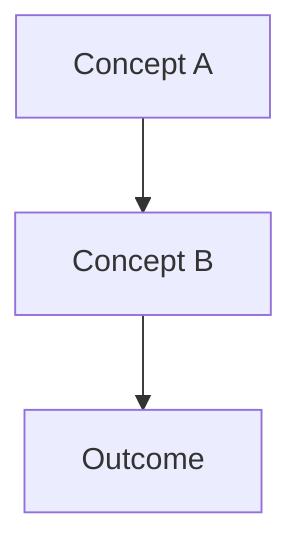

# Note Template

## TL;DR

- Output notes follow a consistent structure for readability and vault integration.
- YAML frontmatter captures metadata for search and filtering.
- Collapsible callouts organize multi-source findings.
- Mermaid diagrams visualize complex concepts when applicable.

## Template Structure

```markdown
---
tags:
  - deep-research
  - <topic-tag>
created: <YYYY-MM-DD>
sources:
  - web-search
  - context7
  - deepwiki
skill: deep-research
topic: "<original topic string>"
---

# <Topic Title>

## TL;DR

- <3-5 bullet summary of key findings>
- <Most important insight>
- <Actionable recommendation if applicable>

## Overview

<1-2 paragraph synthesis of the research>

<If applicable, include Mermaid diagram here>



## Research Findings

> [!abstract]- Web Search Findings
> ### Key Sources
> - [Source Title](https://example.com) - Brief description
> - [Source Title](https://example.com) - Brief description
>
> ### Summary
> <Synthesized findings from web search>

> [!info]- Context7 Documentation
> ### Library/Framework
> <Library name and version>
>
> ### Key Points
> - <Documentation insight>
> - <Code pattern or API detail>
>
> ### Code Examples
> ```<language>
> // Example from docs
> ```

> [!tip]- DeepWiki Repository Insights
> ### Repository
> <repo-name>
>
> ### Architecture Notes
> - <Codebase insight>
> - <Implementation pattern>
>
> ### Relevant Files
> - `path/to/file.ts` - Description

## Synthesis

<Merged analysis combining all sources>

### Key Patterns

1. **Pattern Name**: Description and when to use
2. **Pattern Name**: Description and when to use

### Recommendations

- <Actionable recommendation>
- <Best practice>

### Caveats

- <Limitation or edge case>
- <Version-specific consideration>

## Related Notes

- <wikilink to related note> - How it relates
- <wikilink to related note> - How it relates

## Sources

1. [Title](https://example.com) - accessed <date>
2. [Title](https://example.com) - accessed <date>
3. Context7: <library-id> - <query summary>
4. DeepWiki: <repo-name> - <question summary>
```

## YAML Frontmatter Fields

| Field | Required | Description |
|-------|----------|-------------|
| `tags` | Yes | Always includes `deep-research` plus topic-specific tags |
| `created` | Yes | ISO date of note creation |
| `sources` | Yes | List of source types used (web-search, context7, deepwiki) |
| `skill` | Yes | Always `deep-research` for provenance tracking |
| `topic` | Yes | Original topic string for reference |

## Callout Section Guidelines

### Web Search Findings
- Include 2-5 most relevant sources
- Provide brief description of each source's relevance
- Synthesize findings rather than copy-pasting

### Context7 Documentation
- Specify library name and version when available
- Include code examples when they clarify usage
- Note any version-specific behavior

### DeepWiki Repository Insights
- Focus on architecture and implementation patterns
- Reference specific files when helpful
- Avoid duplicating information from official docs

## Mermaid Diagram Guidelines

Follow the Mermaid rules in [[AGENTS#Mermaid (Obsidian Compatibility)|CLAUDE.md]].

Include diagrams when:

- Explaining system architecture
- Showing data flow or process steps
- Comparing alternatives visually
- Clarifying relationships between concepts

Skip diagrams for:

- Simple factual lookups
- Single-concept explanations
- Topics that are purely textual

## Section Omission Rules

Omit sections when they add no value:

- Skip empty callout sections (if no Context7 results, omit that callout)
- Skip Mermaid if topic doesn't benefit from visualization
- Skip Caveats if none are relevant
- Keep TL;DR, Overview, and Sources always present

## Wikilink Guidelines

In Related Notes section:

- Link to existing vault notes on similar topics
- Use descriptive link text: `[[note-name|Descriptive Title]]`
- Explain the relationship briefly
- If no related notes exist, include the section with "No existing related notes found"

## Related

- [Deep Research Skill](../SKILL.md)
- [Routing Rules](routing-rules.md)
