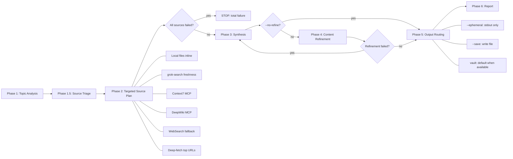

# Deep Research

## Overview

Source-triaged research engine that starts with local evidence, assumes externally mutable topics need current truth, selects the smallest source plan that can answer the question, escalates only when evidence is thin or contradictory, then synthesizes findings into a structured report with freshness and verification status. Output is flexible: print to terminal, save as markdown file, or integrate with a skillwiki vault.



## Model Strategy

Deep research spawns parallel agents for source gathering and content refinement. To balance cost and quality, each phase pins to a model tier matched to its complexity:

| Phase | Model | Rationale |
|-------|-------|-----------|
| Phase 2: Research agents | `sonnet` (or `haiku` for simple fetches) | Parallel reading, fetching, summarizing — mechanical and independent work |
| Phase 3: Synthesis | *(inherit)* | Cross-source reasoning, pattern merging, diagram generation — benefits from parent model capability |
| Phase 4: Refinement | `sonnet` | Redundancy removal, prose tightening — editorial work, no architectural judgment |

All Phase 2 and Phase 4 agents are spawned via the Agent tool with `model: "sonnet"` (drop to `model: "haiku"` for simple single-page fetches). Phase 3 synthesis runs in the parent session context and inherits the parent model.

**Cost impact**: When the parent session runs Opus, research and refinement agents run on Sonnet (~5-10x cheaper per token), while only the cross-source synthesis phase uses the parent model.

**Agent model specification** (see `concepts/claude-code-agent-model-specification`): The Agent tool's `model` parameter overrides the agent definition's frontmatter `model:` field. Valid values: `"sonnet"`, `"opus"`, `"haiku"`, or a full model ID. Do NOT set `model:` in skill frontmatter — it causes the skill to register as an agent, inflating the agent count. Always specify model at Agent spawn time or in agent `.md` frontmatter.

## Platform Adaptation

deep-research uses Claude Code tool names (`Agent`, `TodoWrite`) and the
`model: "sonnet"`/`"haiku"` Agent-tool parameter. Under OpenAI Codex CLI or the
Codex App these map to platform equivalents — `Agent` → `spawn_agent` /
`wait_agent` / `close_agent`, with `[features] multi_agent = true` required in
`~/.codex/config.toml` for the Phase 2 fan-out. The per-agent model pinning is a
cost optimization ("cheap tier for mechanical gather/refine work"), not a hard
requirement. See `references/codex-tools.md` for the full tool mapping, the
multi_agent config gate, the model-tier fallback, and detached-HEAD sandbox
handling for vault writes. Discovery on Codex is via `~/.agents/skills/`.

## When to Use

- User requests comprehensive research on a topic
- User wants deep investigation across multiple sources
- Topic involves libraries, frameworks, GitHub repos, or general concepts
- User mentions "research", "investigate", "compare", "analyze", or "deep dive"
- Topic involves "latest", current behavior, versions, releases, changelogs, marketplace state, package metadata, GitHub issues/PRs, or other externally mutable facts

Do NOT use for:
- Quick factual lookups (use direct web search or docs lookup)
- Single-source questions (use Context7, local files, or web search directly)
- Fully local, non-freshness-sensitive answers when ordinary local file inspection is enough; read local files directly and note that external verification was intentionally skipped

## Output Modes

The skill auto-detects the best output mode based on vault availability:

| Flag | Mode | Behavior |
|------|------|----------|
| *(auto, default)* | **vault** when `skillwiki path` succeeds, else **stdout** | Research persists as a query page when a vault exists |
| `--ephemeral` | **stdout** | Explicitly skip vault saving — print to terminal only |
| `--save <path>` | **file** | Write markdown report to specified path |
| `--vault` | **vault** | Force vault mode (error if no vault configured) |

**Why vault by default?** Deep research is expensive (multiple web searches, fetches, synthesis rounds). When a user has invested in a skillwiki vault, they've opted into knowledge persistence. Defaulting to vault ensures research survives context compression and becomes queryable by future sessions. The publisher transaction makes that persistence atomic with respect to its page, index, and log updates.

## Workflow

### Phase 1: Topic Analysis

1. Parse topic string for keywords, libraries, frameworks
2. **Auto-detect output mode**: run `skillwiki path` — if it returns a valid vault, default to vault mode. If `NO_VAULT_CONFIGURED`, use stdout.
3. If vault mode active: run `skillwiki lang` for output language, search existing pages for cross-linking
4. Read applicable workspace instructions such as `AGENTS.md`, `CLAUDE.md`, `GEMINI.md`, or repo policy files. If they define a source matrix, follow it. Otherwise use the default source ordering from Phase 1.5.
5. If no vault: proceed with research in user's language

### Phase 1.5: Source Triage

Classify the topic with combinable tags, then build the smallest source plan that can answer those tags. Do local triage inline; reading local files to classify the task is not a violation of the cost model.

**Default source order** when workspace instructions do not override it:

1. Local repository, cache, installed plugin, lockfile, release-note, and implementation files
2. Context7 for library/framework/API behavior and usage details
3. DevTools/browser verification only for browser-facing live behavior
4. grok-search for latest/current/freshness-sensitive external facts, with native WebSearch as fallback
5. DeepWiki for remote repository architecture when useful

**Tags:**

- `local-answerable`: authoritative evidence is on disk
- `externally-mutable`: external state may have changed since local files were written
- `freshness-sensitive`: the topic involves latest/current versions, releases, changelogs, package or marketplace state, GitHub issues/PRs, or recent docs
- `library-framework-api`: the topic asks about library/framework/API behavior or usage
- `repo-architecture`: the topic asks about repository structure or implementation design
- `general-exploratory`: the user asks for a broad survey, comparison, literature review, or multi-source research
- `browser-live`: the topic requires browser snapshots, console, network, or live UI verification

**Source plan rules:**

- `local-answerable` only: read local files inline and skip the full Phase 2 fan-out.
- `local-answerable + externally-mutable`: read local files inline, then run one focused grok-search freshness probe. Treat local files as evidence, not final current truth.
- `freshness-sensitive`: assume the user wants the latest/current truth unless they explicitly request historical, offline, or local-only analysis. Prefer grok-search, then deep-fetch authoritative sources found by it.
- `library-framework-api`: lead with Context7. Add grok-search when the question also involves versions, releases, deprecations, regressions, or latest/current behavior.
- `repo-architecture`: use local repo files first if checked out locally; use DeepWiki when remote repo insight is needed.
- `general-exploratory`: use the broader fan-out after the minimal tagged plan is insufficient or when the user explicitly wants exhaustive multi-source research.
- `browser-live`: use DevTools/browser verification only for browser-facing live behavior.

Escalate from the minimal source plan to broader fan-out only when local and targeted external sources disagree, key claims remain unverified, the topic is genuinely broad/exploratory/comparative, the user explicitly asks for exhaustive research, or the minimal plan returns too little evidence.

### Phase 2: Targeted Source Research

Run the source plan from Phase 1.5. Spawn external research agents only for the sources selected by the tags. All spawned agents use `model: "sonnet"` for cost efficiency — research tasks (search, fetch, read, summarize) are mechanical work that Sonnet handles well. For trivial single-page fetches, drop to `model: "haiku"`.

**Local evidence** (inline)
```
Read the relevant local files directly: repo files, plugin caches, installed plugin metadata, lockfiles, release notes, package manifests, and prior vault query pages. Record exact paths and commands used.
```

**grok-search Freshness Agent** (preferred for latest/current facts)
```
Agent(description: "Freshness search", model: "sonnet", prompt: "Use grok-search MCP tools, preferring mcp__grok-search__web_search and get_sources when available, to verify current facts for: <topic>. Focus on official release notes, changelogs, package registries, marketplace metadata, GitHub releases/issues/PRs, and owning-project docs. Report underlying source URLs and mark whether each key claim is externally verified, locally verified only, or unverified.")
```
- If grok-search is unavailable or fails, fall back to native WebSearch and state the degradation.
- grok-search is a discovery route, not the authority by itself; cite the underlying authoritative sources returned via `get_sources` or deep-fetch.

**Context7 Agent** (library/framework/API behavior)
```
Agent(description: "Context7 docs", model: "sonnet", prompt: "Using Context7 MCP: resolve-library-id for <library>, then query-docs for <topic> usage patterns and code examples. Max 3 total Context7 calls. Report findings and note whether they verify current API/library behavior.")
```

**DeepWiki Agent** (remote repository architecture)
```
Agent(description: "DeepWiki repo", model: "sonnet", prompt: "Using DeepWiki MCP: ask_question on <repo> about architecture, patterns, and implementation relevant to <topic>. Report findings.")
```

**Native WebSearch Agents** (fallback or broad exploration)
```
Agent(description: "Web search fallback", model: "sonnet", prompt: "Use native WebSearch for: <topic>. Use only if grok-search is unavailable, insufficient, or broader exploratory web coverage is explicitly needed. Focus on official and primary sources. Report key findings with source URLs.")
```

**Deep-Fetch Agents** (after search results arrive, 1-3 parallel)
```
Agent(description: "Deep-fetch N", model: "haiku", prompt: "Fetch and extract key passages from <URL>. Focus on specific facts, code examples, or claims relevant to <topic>. Skip navigation and boilerplate.")
```
- Prioritize official docs, changelogs, release notes, package registries, GitHub sources, and primary project pages over aggregators and forums.

**Graceful degradation**: If any selected source fails, continue with remaining sources. Note failures and degraded freshness checks in the report. Only stop when every source required by the selected source plan fails and no useful local evidence exists.

### Phase 3: Synthesis

Compose research report with these sections:

1. **TL;DR** -- 3-5 bullets of key findings
2. **Overview** -- 1-2 paragraph synthesis
3. **Mermaid diagram** -- select type based on topic (see mapping table below). Skip for simple factual topics with no structural relationships

**Topic -> Diagram Type Mapping**

| Research topic type | Diagram type | Example |
|---|---|---|
| System architecture / APIs | `sequenceDiagram` or component `flowchart` | How /goal's app-server handles thread/goal/set -> emit event |
| Process / workflow | `flowchart LR` with decision nodes | Ralph Loop: plan->act->test->review->iterate |
| Comparison | Side-by-side `flowchart` | Codex /goal vs manual Ralph Loop |
| Concept relationships | `flowchart TD` with subgraphs | How /goal relates to config.toml, app-server, TUI |
| Data model / schema | `classDiagram` or `erDiagram` | Goal object: threadId, objective, status, tokenBudget |
| Timeline / changelog | `gantt` or timeline `flowchart` | v0.125 -> v0.128 feature rollout |
| Simple factual | Skip diagram | "API accepts these 5 parameters" |
4. **Findings** -- organized by source type with collapsible callouts
   - `> [!note]- Local Evidence`
   - `> [!abstract]- Freshness Search (grok-search/WebSearch)`
   - `> [!abstract]- Web Search Findings`
   - `> [!info]- Documentation (Context7)`
   - `> [!tip]- Repository Insights (DeepWiki)`
5. **Freshness & Verification Status** -- compact audit table for key claims:
   | Claim | Status | Source route | Notes |
   |---|---|---|---|
   | <claim> | externally verified / locally verified only / unverified freshness claim | local -> grok-search -> official source | <conflicts, cache freshness, fallback notes> |
   Include the selected source-plan tags, freshness channel used, fallback/degradation, source conflicts, and stale local cache warnings. Use one authoritative external source as enough verification by default; require a second source for high-risk, indirect, ambiguous, or contradictory claims.
6. **Verification Methods** -- how to verify or reproduce the findings. This is critical: research that documents WHAT was found but not HOW to verify it creates fragile knowledge. Include:
   - The correct tools or commands to confirm the finding
   - Common wrong verification methods and why they fail (e.g., "checking `claude --help` for slash commands" vs "type `/` in session")
   - Links to canonical reference pages
7. **Analysis** -- merged patterns, recommendations, caveats
8. **Sources** -- numbered list with access dates

### Phase 4: Content Refinement (unless --no-refine)

Spawn a refinement agent with `model: "sonnet"` — tightening prose and removing redundancy is editorial work that doesn't require the parent model's capability.

```
Agent(description: "Refine report", model: "sonnet", prompt: "Refine this research report with two passes:

Pass A — Consolidation:
- Remove redundancy across callout sections
- Move repeated content into Analysis
- Merge similar examples or findings

Pass B — Tightening:
- Reduce verbose prose
- Verify TL;DR accuracy against full findings
- Check Mermaid rendering (if diagram present)
- Trim sources to top 5-7 most authoritative
- Verify Verification Methods section is actionable (not just 'check the docs')

Original report:
<insert synthesized report from Phase 3>")
```

**Skip refinement** when:
- `--no-refine` flag is set
- All sources returned minimal content (nothing to consolidate)

### Phase 5: Output Routing

Route output based on active mode:

**`--ephemeral` / stdout (when no vault)**: Print the full structured report directly to terminal.

**`--save <path>`**: Write the report as a markdown file to the specified path. Create parent directories if needed. Save a checkpoint draft before refinement so the raw synthesis is recoverable if refinement introduces errors.

**Vault (default when vault available)**: Vault mode composes pages as unpublished drafts and delegates taxonomy, final page publication, index, and log updates to `skillwiki page publish` through `references/vault-pipeline.md`. Missing publisher capability is fail-closed; do not fall back to direct vault writes. Also scan vault index for existing related pages and add wikilinks in the Related Notes section.

> **IMPORTANT — wiki-add-task routing guard**: Do NOT invoke `wiki-add-task` during Phase 5 for any reason. Any vault-capture intent (e.g., "save this to the vault", "capture this finding", "log this research") must route through `references/vault-pipeline.md` directly. If `wiki-add-task` activates, discard its output and resume with the vault-pipeline workflow.

**Vault page type**: Default to `queries/` (research results are filed queries). If the research reveals a generalized, reusable pattern (not specific to one investigation), also create a companion `concepts/` page capturing the transferable knowledge. The query captures the specific investigation; the concept captures the reusable insight.

**Follow-up work**: If the research produces actionable follow-up work, queue
it only after the typed research page(s) publish successfully. Use the schema-compatible
follow-up queue in `references/vault-pipeline.md`: proposed work items only
when `skillwiki validate` accepts that non-executing status, otherwise
ad-hoc captures under `raw/transcripts/`. Do not turn research ideas directly
into `planned` work items during Phase 5.

### Phase 6: Report

Print a summary block:

```
Deep Research Complete
----------------------
Topic: <topic>
Mode: vault | stdout | file

Sources Queried:
  - Source plan tags: <tags>
  - Local evidence: <paths or "not used">
  - grok-search freshness: <used/fallback/unavailable/not needed> (model: sonnet when spawned)
  - Web search fallback: <count or "not used"> (model: sonnet)
  - Deep-fetch: <count> agents (model: haiku)
  - Context7: <library-id or "not used"> (model: sonnet)
  - DeepWiki: <repo or "not used"> (model: sonnet)
  - Freshness status: <externally verified / locally verified only / unverified freshness claim>

Synthesis: parent session (model: inherit)
Refinement: <"applied (model: sonnet)" or "skipped (--no-refine)">
Output: <vault page path, file path, or "terminal">
Pages created: <list of vault pages, if any>
Warnings: <any>
```

## Flags

| Flag | Effect |
|------|--------|
| `--ephemeral` | Skip vault saving — print to terminal only. Use when research is truly one-off. |
| `--save <path>` | Write markdown report to file |
| `--vault` | Force vault mode (error if no vault configured) |
| `--type <concept\|comparison\|query\|entity>` | Force page type (vault mode only, default: query) |
| `--no-raw` | Skip raw source capture (vault mode: no provenance chain) |
| `--no-refine` | Skip content refinement phase |

## Stop Conditions

- Every source required by the selected source plan fails and no useful local evidence exists
- `--vault` flag explicitly set but `skillwiki path` returns NO_VAULT_CONFIGURED
- Vault mode: publisher capability is unavailable, dry-run fails, or publication fails (retain the draft and operation ID; do not write directly to the vault)
- `wiki-add-task` skill activates during Phase 5 output routing (abort wiki-add-task, resume vault-pipeline.md directly)

## Failure Handling

| Failure | Action |
|---------|--------|
| grok-search fails | Fall back to native WebSearch; if that also fails, mark freshness-sensitive claims as locally verified only or unverified |
| Web search fails | Continue; omit web findings section or mark fallback unavailable |
| Deep-fetch fails | Continue with search snippets; note in report |
| Context7 fails | Continue; omit Context7 section |
| DeepWiki fails | Continue; omit DeepWiki section |
| Selected source plan fails | STOP only when no useful local evidence exists; otherwise report degraded verification |
| Refinement fails | Keep pre-refinement version; warn in report |
| Vault not configured (auto mode) | Fall back to stdout; note in report |
| Vault not configured (`--vault` flag) | Abort with advisory to run `skillwiki init` |
| Vault publisher capability or publication fails | STOP; retain the draft and operation ID; do not write directly to the vault |

## Tool Usage

- **Agent tool** (`model: "sonnet"` or `"haiku"`): Spawn research and refinement agents. The `model` parameter is mandatory for Phase 2 and 4 agents — see Model Strategy section. See `concepts/claude-code-agent-model-specification` for the full model resolution rules.
- **Local file tools**: Source triage, local evidence, installed caches, release notes, repo files
- **grok-search MCP**: Preferred latest/current/freshness-sensitive source discovery; use `get_sources` for provenance when available
- **Web search**: Fallback or supplementary current information when grok-search is unavailable or insufficient
- **Web fetch**: Deep-fetch top sources for richer content extraction (used inside deep-fetch agents)
- **Context7 MCP**: Library/framework documentation (used inside Context7 agent)
- **DeepWiki MCP**: GitHub repository insights (used inside DeepWiki agent)
- **skillwiki CLI**: `skillwiki path` (auto-detect vault), `skillwiki lang` (output language), `skillwiki hash`, `skillwiki validate`, `skillwiki page publish`

## Related Reference

- **references/vault-pipeline.md**: Vault-mode raw capture, validation, transactional page publication, and follow-up queue workflow
- **references/codex-tools.md**: Codex CLI/App tool mapping (`Agent` → `spawn_agent`/`wait_agent`), `multi_agent` config gate, model-tier fallback, and detached-HEAD sandbox handling
