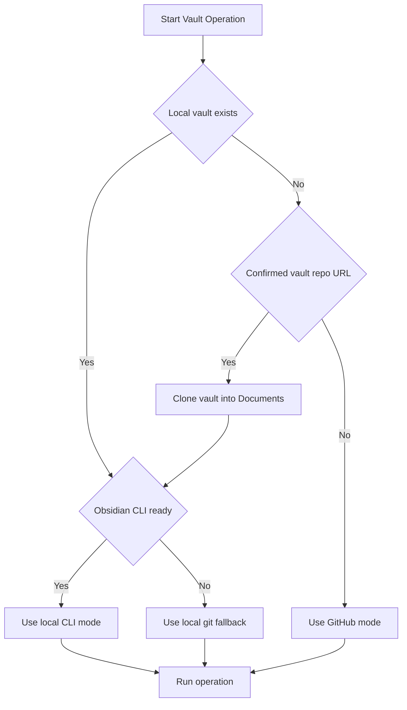

# Obsidian GH Knowledge (CLI-first)

## TL;DR
- **Goal:** Bootstrap and operate the Obsidian vault using the safest and most optimal method depending on the environment context.
- **Execution Order:** 0. Bootstrap a local clone after repo confirmation -> 1. Local Obsidian CLI -> 2. Local fallback -> 3. GitHub API fallback.
- **Agent Rules:** Agents **must** read before write, include a `## TL;DR`, and **must** use Mermaid diagrams for visual explanations.
- **Project Scoping:** When working on a specific project (cmux, trends, etc.), **stay within that project's folder** under `5️⃣-Projects/GitHub/<project>/`. See "Project Scoping (CRITICAL)" section below.
- **Local Wrapper:** Use `scripts/local_obsidian_knowledge.py` for repeatable local macOS workflows that combine Obsidian CLI operations with this vault's project rules and git sync.
- **Raw Materials:** If the vault mounts `raw/` as a Git submodule, treat it as source-input storage rather than curated note space.
- **Inbox Split:** `raw/inbox` is the default intake lane for external source material. `0️⃣-Inbox` is curated staging for notes that already contain synthesis and still need routing.
- **Health Default:** Use `simplify-review` first when the vault feels hard to read or hard to trust; it reconciles full-vault Obsidian counts with active-scope graph checks and overview readability audits.

## Execution Mode Flowchart



Use this skill to bootstrap and manage an Obsidian vault safely and consistently.

## Intake lane split (critical)

Keep the two inboxes semantically strict:

- `raw/inbox`: clipped articles, copied posts, transcripts, imported markdown, and other preserved source material.
- `0️⃣-Inbox`: curated notes that already contain synthesis, project framing, or structured writeup but still need routing.

Decision rule:

- If the user wants to preserve source material itself, use `capture-raw` into `raw/inbox`.
- If the user wants a note that already reflects reasoning or synthesis, use `capture` into `0️⃣-Inbox` or write directly into the final project folder.
- Do not use `0️⃣-Inbox` as a raw-material dumping ground.
- Search curated notes first and `raw/` second.

## Source of truth

- Primary live docs: Context7 Obsidian CLI index (`/websites/help_obsidian_md_cli`)
- Official CLI docs: `https://help.obsidian.md/cli/index`
- Public release note introducing CLI: `https://obsidian.md/changelog/2026-02-27-desktop-v1.12.4/`
- Upstream reusable skill set: `https://github.com/kepano/obsidian-skills`

Note: CLI docs may still show early-access wording in some sections. Treat the public changelog (February 27, 2026) as the release marker.

## Recommended skill layering

Use the generic upstream skills and the local repo-specific skill for different jobs:

- `kepano/obsidian-skills/skills/obsidian-cli`: canonical command syntax and current CLI feature surface.
- `kepano/obsidian-skills/skills/obsidian-markdown`: generic Obsidian-flavored Markdown authoring rules.
- `kepano/obsidian-skills/skills/obsidian-bases`: `.base` dashboards and structured knowledge views.
- `obsidian-gh-knowledge` in this repo: local vault bootstrap, project scoping, emoji-folder guardrails, git sync, and GitHub fallback.

The local helper script `scripts/local_obsidian_knowledge.py` is the bridge between the upstream generic CLI patterns and this vault's repo-specific conventions.

## Execution modes (strict order)

0. **Bootstrap local vault**
   - Use when local vault is missing and the user confirms the vault repo URL.
   - Prefer cloning into `~/Documents/<repo-name>` for the current user, then write `local_vault_path` to config.
1. **Local Obsidian CLI mode (preferred after bootstrap)**
   - Use when local vault exists and `obsidian` CLI is available and enabled.
2. **Local filesystem/git fallback**
   - Use when local vault exists but CLI is not enabled.
3. **GitHub mode fallback**
   - Use when local vault is unavailable, bootstrap is not confirmed, or local access is explicitly disabled.

This ordering is for compatibility across desktop, server, and sandbox environments.

## Mode selection (local vs GitHub)

1. Resolve `VAULT_DIR`:
   - If `~/.config/obsidian-gh-knowledge/config.json` has `local_vault_path`, use it.
   - Else use `~/Documents/obsidian_vault/`.
2. If `VAULT_DIR` does not exist and the user has confirmed a vault repo URL, run the bootstrap script, then re-resolve `VAULT_DIR`.
3. If `VAULT_DIR` exists and `prefer_local` is not `false`, use local mode.
4. In local mode, prefer official Obsidian CLI only if:
   - `command -v obsidian` succeeds, and
   - `obsidian help` succeeds (CLI is enabled and app connection works).
5. If CLI checks fail, fall back to local filesystem/git mode.
6. If local mode is unavailable, use GitHub mode.

## Script path helper

Use one helper to find bundled scripts across repo-local and user-skill layouts:

```bash
resolve_obsidian_gh_script() {
  local name="$1"
  local path
  for path in \
    "skills/obsidian-gh-knowledge/scripts/$name" \
    "agent-skills/skills/obsidian-gh-knowledge/scripts/$name" \
    "scripts/$name" \
    "$HOME/.agents/skills/obsidian-gh-knowledge/scripts/$name"
  do
    if [ -f "$path" ]; then
      printf '%s\n' "$path"
      return 0
    fi
  done
  echo "Could not find obsidian-gh-knowledge script: $name" >&2
  return 1
}
```

## First-time workspace bootstrap

Use this workflow when a new workspace does not yet have the vault checked out locally.

Rules:

- Do **not** guess the vault repo. Ask the user to confirm the exact GitHub repo URL first.
- After the user confirms a repo such as `https://github.com/karlorz/obsidian_vault`, prefer a local clone over GitHub-only mode.
- Default destination is `~/Documents/<repo-name>`. For the example above, that becomes `~/Documents/obsidian_vault`.
- `~` is user-specific. If the current user is `root`, the default destination becomes `/root/Documents/<repo-name>`.
- Use `--vault-dir` only when the user explicitly wants a different destination.

Run it after confirmation:

```bash
INIT_SCRIPT_PATH="$(resolve_obsidian_gh_script init_local_vault.py)"

python3 "$INIT_SCRIPT_PATH" \
  --repo-url "https://github.com/karlorz/obsidian_vault" \
  --repo-key personal
```

What the bootstrap script does:

- Clones the confirmed vault repo into `~/Documents/<repo-name>` unless the user provided `--vault-dir`.
- Reuses the directory if it is already a clone of the same repo.
- Can optionally initialize a raw-materials submodule such as `raw/` when `--raw-submodule-url` and `--init-raw-submodule` are provided.
- Updates `~/.config/obsidian-gh-knowledge/config.json`:
  - Sets `local_vault_path`
  - Sets `prefer_local` to `true`
  - Sets `default_repo` if it is currently missing
  - Adds `repos.<key>` if `--repo-key` is provided
  - Sets `vault_name` if it is currently missing
  - Sets `raw_submodule_path` and `raw_submodule_url` when raw-submodule bootstrap is used

Optional raw-submodule bootstrap:

```bash
python3 "$INIT_SCRIPT_PATH" \
  --repo-url "https://github.com/karlorz/obsidian_vault" \
  --repo-key personal \
  --raw-submodule-url "https://github.com/karlorz/obsidian_vault_raw.git" \
  --init-raw-submodule
```

After bootstrap, re-run mode selection and prefer local CLI or local git fallback from the new `local_vault_path`.

## Guardrails (avoid wrong paths)

- Do **not** suppress errors when checking paths (avoid `2>/dev/null`); missing paths should be obvious.
- If local vault is "missing", print diagnostics: `pwd`, `echo "$HOME"`, and `ls -la "$(dirname "$VAULT_DIR")"` before deciding between bootstrap and GitHub fallback.
- Do **not** hand-type emoji folder names. Always `ls`/`list` and copy the exact path.
- This vault uses names like `5️⃣-Projects` (no space). `5️⃣ -Projects` will break local `ls` and GitHub reads.
- If a `read` fails with "File not found", immediately `list` the parent folder or `search` for the filename instead of guessing.
- If you need the emoji folder name programmatically: `ls -1 "$VAULT_DIR" | rg -m1 "Projects$"` (returns `5️⃣-Projects` in this vault).
- Do **not** clone a repo or overwrite `local_vault_path` until the user has confirmed the vault repo URL.

### Project Scoping (CRITICAL)

> [!warning] Common Mistake
> Agents often navigate to the wrong project folder (e.g., going to `trends/` when working on `cmux`). This wastes context and confuses the user.

**Rules for project-scoped operations:**

1. **Determine current project context FIRST** before any vault operation:
   - Check the current working directory (e.g., `/root/workspace` -> look for `CLAUDE.md` or `package.json` to identify project)
   - Check conversation context for project mentions
   - If ambiguous, **ask the user** which project they mean

2. **Scope ALL operations** (reads AND writes) to the correct project folder:
   - Project folders live under `5️⃣-Projects/GitHub/<project>/`
   - Example: cmux project -> `5️⃣-Projects/GitHub/cmux/`
   - Example: trends project -> `5️⃣-Projects/GitHub/trends/`

3. **Always read `<project>/_Overview.md` first** to confirm you're in the right place before any other reads or writes.

4. **Never cross project boundaries** without explicit user request:
   - If working on `cmux`, do not read/write to `trends/` folder
   - If user asks for "roadmap" in cmux context, look in `cmux/cmux-agent-dev-roadmap.md`, NOT `trends/trends-dev-roadmap.md`

5. **Project detection heuristic** (in order):
   ```bash
   # 1. Check if current workspace has project identifier
   if [ -f "CLAUDE.md" ]; then
     PROJECT=$(grep -m1 "project.*cmux\|project.*trends" CLAUDE.md | grep -oE "cmux|trends" | head -1)
   fi

   # 2. Check package.json name field
   if [ -z "$PROJECT" ] && [ -f "package.json" ]; then
     PROJECT=$(jq -r '.name // empty' package.json 2>/dev/null | grep -oE "cmux|trends" | head -1)
   fi

   # 3. Check git remote
   if [ -z "$PROJECT" ]; then
     PROJECT=$(git remote get-url origin 2>/dev/null | grep -oE "cmux|trends" | head -1)
   fi
   ```

6. **When listing project folders**, always show what's available:
   ```bash
   ls "$VAULT_DIR/5️⃣-Projects/GitHub/"
   # Output: cmux  data-labeling  openclaw  trends
   ```

Quick checks:

```bash
# Local vault path
python3 - <<'PY'
import json, os
p = os.path.expanduser('~/.config/obsidian-gh-knowledge/config.json')
if os.path.exists(p):
    c = json.load(open(p))
    print(os.path.expanduser(c.get('local_vault_path', '~/Documents/obsidian_vault')))
else:
    print(os.path.expanduser('~/Documents/obsidian_vault'))
PY

# CLI availability
command -v obsidian
obsidian help
```

If `obsidian help` prints `Command line interface is not enabled`, use local filesystem fallback until enabled in Obsidian settings.

## Environment compatibility

- macOS/Windows desktop with Obsidian app running: use local Obsidian CLI mode.
- Linux desktop with Obsidian GUI available: CLI may work, use same checks above.
- Headless Linux/container/sandbox (no GUI app session): assume Obsidian CLI is unavailable and skip directly to local filesystem or GitHub mode.
- In many sandboxes, `~/.config/obsidian-gh-knowledge/config.json` and `~/Documents/obsidian_vault` do not exist by default. Expect either bootstrap with a confirmed repo URL or explicit `--repo` usage.

Do not block execution waiting for CLI in headless environments.

## Local Obsidian CLI mode (preferred)

### Requirements

- Obsidian desktop `1.12+`.
- CLI enabled in app settings: `Settings -> General -> Advanced -> Command line interface`.
- Obsidian app must be able to launch; the first CLI command may start it if it is not already running.
- On macOS, ensure PATH contains `/Applications/Obsidian.app/Contents/MacOS`.
- If CLI commands fail and stderr shows `Unable to find helper app` or `Command line interface is not enabled`, re-enable the CLI toggle in settings and restart the terminal. If commands succeed and only emit the helper warning, treat it as noise and continue.

### Targeting vaults and files

- If current directory is the vault, commands target that vault.
- Otherwise use `vault=<name>` as the first parameter.
- Use `file=<name>` for wikilink-style resolution, or `path=<exact/path.md>` for precise targeting.

Examples:

```bash
# Prefer running inside vault root
cd "$VAULT_DIR"

# Or target by vault name explicitly
obsidian vault="My Vault" search query="test"

# Exact file targeting
obsidian read path="5️⃣-Projects/GitHub/cmux/_Overview.md"
```

### Core command patterns

```bash
# Search and read
obsidian search query="MOC" path="5️⃣-Projects/" format=json
obsidian read path="5️⃣-Projects/GitHub/cmux/_Overview.md"

# Create/update content
obsidian create path="2️⃣-Drafts/new-note.md" content="# Title\n\n## TL;DR\n"
obsidian create path="2️⃣-Drafts/new-note.md" content="# Title\n\n## TL;DR\n- [ ] Follow up" overwrite
obsidian append path="2️⃣-Drafts/new-note.md" content="\n- [ ] Follow up"

# Move/rename and delete
obsidian move path="0️⃣-Inbox/note.md" to="5️⃣-Projects/GitHub/cmux/note.md"
obsidian delete path="2️⃣-Drafts/tmp-note.md"

# Tasks, tags, properties, templates, daily note
obsidian tasks path="5️⃣-Projects/GitHub/cmux/_Overview.md" todo format=json
obsidian tags counts
obsidian properties path="5️⃣-Projects/GitHub/cmux/_Overview.md"
obsidian templates
obsidian template:read name="github-project-template"
obsidian daily
obsidian daily:append content="- [ ] Review inbox"
```

### High-level local wrapper

For common macOS workflows, prefer the repo-specific helper over hand-building command sequences:

```bash
LOCAL_WRAPPER="$(resolve_obsidian_gh_script local_obsidian_knowledge.py)"

python3 "$LOCAL_WRAPPER" doctor
python3 "$LOCAL_WRAPPER" dashboard
python3 "$LOCAL_WRAPPER" review
python3 "$LOCAL_WRAPPER" simplify-review
python3 "$LOCAL_WRAPPER" audit
python3 "$LOCAL_WRAPPER" fix-tldr --dry-run
python3 "$LOCAL_WRAPPER" structure-report --dry-run
python3 "$LOCAL_WRAPPER" structure-fix --dry-run
python3 "$LOCAL_WRAPPER" archive-fix --dry-run
python3 "$LOCAL_WRAPPER" capture-raw "Clipped article" --source "https://example.com/post"
python3 "$LOCAL_WRAPPER" capture "Curated summary note"
python3 "$LOCAL_WRAPPER" project-note cmux "Feature review"
python3 "$LOCAL_WRAPPER" organize "0️⃣-Inbox/feature-review.md" cmux
python3 "$LOCAL_WRAPPER" sync --message "Update vault notes"
```

`--vault-dir` is a global option. If you need it, place it before the subcommand, for example `python3 "$LOCAL_WRAPPER" --vault-dir "$VAULT_DIR" doctor`.

Wrapper responsibilities:

- Resolves the local vault path from config.
- Reports `raw/` submodule health in `doctor` when configured.
- Verifies the official `obsidian` CLI is available.
- Runs a one-click `review` summary with vault health metrics, task counts, recent files, unresolved-link samples, and explicit raw-vs-curated intake counts.
- Treats `dashboard` and `review` orphan/dead-end numbers as Obsidian full-vault signals, not the precise cleanup scope for active notes.
- Runs a combined `simplify-review` that layers `review`, `audit`, active-scope structure analysis, overview readability checks, and duplicate basename/alias detection into one report note.
- Runs a stricter `audit` for required folders, project `_Overview.md` coverage, `## TL;DR` placement, oversized MOCs, stale `Structure Cleanup Inbox` backlogs, and YAML frontmatter parsing.
- Can bulk-insert placeholder `## TL;DR` sections into notes that are missing one.
- Can generate a local graph-based structure cleanup report for active-scope orphan and dead-end notes without depending on flaky live CLI list output.
- Can apply high-confidence structure fixes by linking dead-end notes to their nearest `_Overview.md` and adding orphan notes to auto-generated cleanup sections inside project MOCs.
- Can create missing `_Archive-Index.md` notes and backlink archived notes so archive folders stay navigable without polluting active MOCs.
- Skips the `raw/` subtree in readability and TL;DR audits because raw materials are source input, not curated notes.
- Treats `raw/inbox` as the default intake lane for external source material and `0️⃣-Inbox` as curated staging.
- Reads `_Overview.md` before project-scoped note creation or organization.
- Uses `obsidian move` so note moves happen inside Obsidian instead of raw shell renames.
- Optionally finishes with `local_vault_git_sync.py`.
- Blocks sync by default when submodules are dirty or uninitialized; use `--allow-dirty-submodules` only when you mean it.

### Local write workflow

1. Read before write (`obsidian read ...`).
2. For large edits, write to a draft note first, then merge intentionally.
3. Keep the remote in sync: pull/rebase, commit, push (no force-push).

Recommended (one command):
```bash
LOCAL_SYNC_SCRIPT="$(resolve_obsidian_gh_script local_vault_git_sync.py)"

python3 "$LOCAL_SYNC_SCRIPT" \
  --vault-dir "$VAULT_DIR" \
  --message "Update vault notes"
```

Manual workflow:
```bash
cd "$VAULT_DIR"
git pull --rebase --autostash
git status --porcelain=v1
git add -A
git commit -m "Update vault notes"
git pull --rebase
git push
```

## Local filesystem/git fallback (CLI unavailable)

Use only when local CLI cannot be used.

```bash
VAULT_DIR="$HOME/Documents/obsidian_vault"

ls -la "$VAULT_DIR"
rg -n "keyword" "$VAULT_DIR"
sed -n '1,160p' "$VAULT_DIR/5️⃣-Projects/GitHub/cmux/_Overview.md"
```

For edits, use the same sync workflow as local CLI mode (commit + pull/rebase + push).

## GitHub mode fallback

Use when local vault is unavailable or `prefer_local` is explicitly `false`.

**GitHub read protocol** (prevents "File not found"):
1. `list` the parent folder to copy the exact path
2. `search` for the filename/keyword if unknown
3. `read` using the returned exact path

### Repo resolution policy

Resolve repo in this order:

1. `--repo <owner/repo>` if provided.
2. `--repo <key>` (no `/`) resolved from `repos.<key>` in config.
3. `default_repo` from config.
4. If none are available, stop and ask for repo/config.

Never guess repo names.

### Requirements

- GitHub CLI installed: `gh`
- Authenticated: `gh auth status`
- Repo access check before reads/writes:
  - `gh repo view <owner/repo> >/dev/null`
  - If this fails, stop and request a repo the current account/team can access.

### Commands

```bash
SCRIPT_PATH="$(resolve_obsidian_gh_script github_knowledge_skill.py)"

python3 "$SCRIPT_PATH" \
  --repo <owner/repo> <command> [args]
```

Available commands:

- `list --path <path>`
- `read <file_path>`
- `search <query>`
- `move <src> <dest> --branch <branch_name> --message <commit_msg>`
- `copy <src> <dest> --branch <branch_name> --message <commit_msg>`
- `write <file_path> --stdin|--from-file <path> --branch <branch_name> --message <commit_msg>`

### Headless Linux smoke checks

Run these before substantial work in sandboxes:

```bash
command -v obsidian || true
gh auth status
python3 "$SCRIPT_PATH" --repo <owner/repo> list --path ""
python3 "$SCRIPT_PATH" --repo <owner/repo> read "README.md"
python3 "$SCRIPT_PATH" --repo <owner/repo> search "filename:_Overview.md"
```

Expected behavior from recent validation:

- `obsidian` is often unavailable in headless Linux.
- GitHub mode works when `--repo` is explicit and `gh` has access.
- Emoji paths are supported when quoted:
  - `python3 "$SCRIPT_PATH" --repo <owner/repo> list --path "0️⃣-Inbox"`

## Safety rules (critical)

1. Never force-push to `main`.
2. In GitHub mode, always write on a feature branch.
3. In GitHub mode, always open a PR for review before merge.
4. Read before write.
5. Keep commits small and scoped.
6. Prefer local vault operations whenever available.

## Practical tips (paths and emoji)

- Always quote paths (`"..."`), especially emoji folders.
- Prefer copying exact paths from command output instead of retyping.
- For 404/path errors in GitHub mode, verify with `list` first.
- If `list` on repo root also fails, treat it as repo permission or wrong account/team context, not just path typo.

## Obsidian note authoring rules

If repository-level `AGENTS.md` exists, follow it first.

### Agent Markdown Rules

- **Mandatory:** Always include a short `## TL;DR` near the top for human scanning.
- **Mandatory:** Always use Mermaid diagrams (`graph TB` or `sequenceDiagram`) to visually explain architectures, workflows, or complex concepts.
- Use Obsidian wikilinks (`[[note-title]]`) for internal notes.
- Keep headings stable unless rename/move is requested.
- Use YAML frontmatter for metadata when needed.

### Mermaid (Obsidian compatibility)

- Prefer `graph TB` / `sequenceDiagram`.
- Use `subgraph "Title"` (avoid `subgraph ID[Label]`).
- Avoid `\n` in labels; use `<br/>` or single-line labels.
- Keep node IDs ASCII and simple (`CMUX_DB`, `OC_GW`).

### Project folder convention

Each project folder under `5️⃣-Projects/` must include `_Overview.md` as MOC.

When creating a project folder:

1. Create folder in the right category (`GitHub`, `Infrastructure`, `Research`).
2. Create `_Overview.md` first.
3. Include quick navigation and documentation index.
4. Link related notes from `_Overview.md`.

## Templates

For GitHub project notes, use `100-Templates/github-project-template.md`.

GitHub mode example:

```bash
python3 ~/.agents/skills/obsidian-gh-knowledge/scripts/github_knowledge_skill.py \
  --repo <owner/repo> read "100-Templates/github-project-template.md"
```

## Config file

Prefer creating `~/.config/obsidian-gh-knowledge/config.json` via `scripts/init_local_vault.py` on first-run. Hand-edit the file only when you need to adjust repos or vault naming.

Config shape:

```json
{
  "default_repo": "<owner>/<vault-repo>",
  "repos": {
    "personal": "<owner>/<vault-repo>",
    "work": "<org>/<work-vault-repo>"
  },
  "local_vault_path": "~/Documents/obsidian_vault",
  "prefer_local": true,
  "vault_name": "My Vault"
}
```

`vault_name` is optional; use it when running CLI commands outside the vault directory.

## Workflow reference

See `references/obsidian-organizer.md` for concrete note-organization workflow patterns.

## Related

- [[vault-operations-index|Vault Operations Index]]
